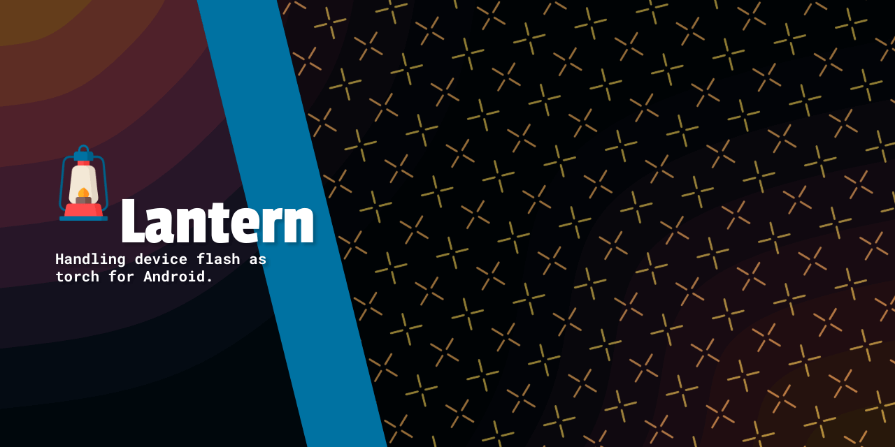

    

 

Handling device flash as torch for Android.

- 📕 Usage Docs (at) https://nisrulz.com/lantern/

- [Changelog](docs/changelog.md)

- Pull Requests

  Here are some basic rules to follow to ensure timely addition of your request:

   - If its a feature, bugfix, or anything please only change code to what you specify.
   - Please keep PR titles easy to read and descriptive of changes, this will make them easier to merge :smile:
   - Pull requests _must_ be made against `develop` branch. Any other branch (unless specified by the maintainers) will get rejected.
   - Check for existing [issues](https://github.com/nisrulz/lantern/issues) first, before filing an issue.

- License

  Copyright 2017 Nishant Srivastava

  Licensed under the Apache License, Version 2.0, [click here for the full license](/LICENSE).

- Logo

  Credit: <a href="https://www.flaticon.com/free-icons/lantern" title="lantern icons">Lantern icons created by Freepik - Flaticon</a>
